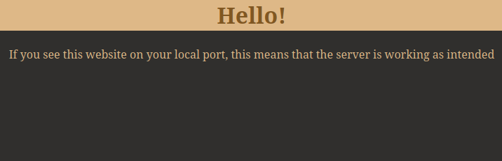

# Simple Web Server made in C
This is a simple web server that can be deployed on a VPS

## Site Preview
This is what the site looks like:

## Usage
### Dependencies
Needs gcc and nginx installed to work

Most linux systems have gcc preinstalled, you may need to install nginx
For Ubuntu/Debian based systems:
    `sudo apt install nginx`

### Installation & Testing
To create a new service:
    `make create-systemd-service`

And then to move the example code to be used by the nginx service:
    `make example-website`

### Deletion
Remove the service:
    `make remove-systemd-service`

and then the website:
    `make remove-example-website`
